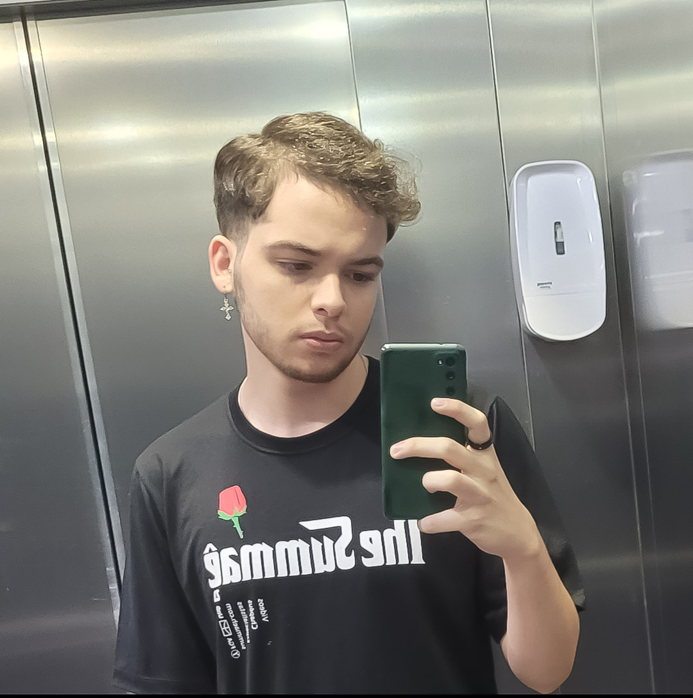

# :mag_right: Grupo 1 - Interação Humano Computador

<!-- 

    Logo do nosso app

 -->

## :round_pushpin: Sobre o projeto:

Este projeto, desenvolvido para a disciplina de Interação Humano-Computador (IHC) da Universidade de Brasília (UnB), será conduzido por estudantes de Engenharia de Software. O foco principal é realizar uma análise detalhada de um site, identificando suas limitações e problemas de usabilidade, com o intuito de propor e apresentar soluções eficazes para essas questões.
<!-- 
## :round_pushpin: Nome do app
Link do site:  -->

<!-- ## :round_pushpin: Direitos autorais e licença -->

## :round_pushpin: Equipe do projeto:
Os integrantes que compõem o grupo 1 estão presentes na Tabela 1.

    <table>
    <tr>
        <th>Foto</th>
        <th>Nome</th>
        <th>Email</th>
        <th>GitHub</th>
    </tr>
    <tr>
        <td></td>
        <td>Carla A. C. Ribeiro</td>
        <td>carlacarlaclementino@gmail.com</td>
        <td><a href="https://github.com/ccarlaa">@ccarlaa</a></td>
    </tr>
    <tr>
        <td></td>
        <td>Eduarda Rodrigues Tavares</td>
        <td>erteduarda@gmail.com</td>
        <td><a href="https://github.com/erteduarda">@erteduarda</a></td>
    </tr>
    <tr>
        <td></td>
        <td>Davi dos Santos Brito Nobre</td>
        <td>davinobre.ik@gmail.com</td>
        <td><a href="https://github.com/Jagaima">@Jagaima</a></td>
    </tr>
    <tr>
        <td></td>
        <td>Gabriel Santos Monteiro</td>
        <td>gabrielmonteiro1203@gmail.com</td>
        <td><a href="https://github.com/GabrielSMonteiro">@GabrielSMonteiro</a></td>
    </tr>
    <tr>
        <td></td>
        <td>João Vitor Lopes Ribeiro</td>
        <td>joao.vitortnt5@gmail.com</td>
        <td><a href="https://github.com/">@</a></td>
    </tr>
    </table>
    
Tabela 1: Integrantes do Grupo 1 (Fonte: autores, 2024)

## :round_pushpin: Histórico de Versão

    <table>
    <tr>
        <th>Data</th>
        <th>Data de Revisão</th>
        <th>Versão</th>
        <th>Descrição</th>
        <th>Autor</th>
        <th>Revisor</th>
    </tr>
    <tr>
        <td>22/10/2024</td>
        <td>22/10/2024</td>
        <td>1.*</td>
        <td>Criação inicial</td>
        <td><a href="https://github.com/ccarlaa">Carla</a></td>
        <td></td>
    </tr>
    </table>

