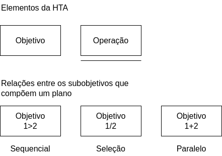
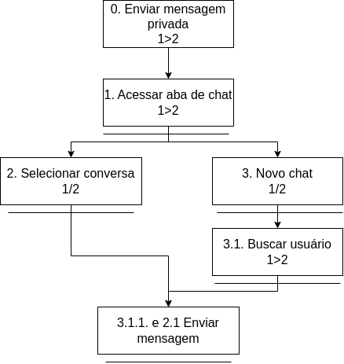
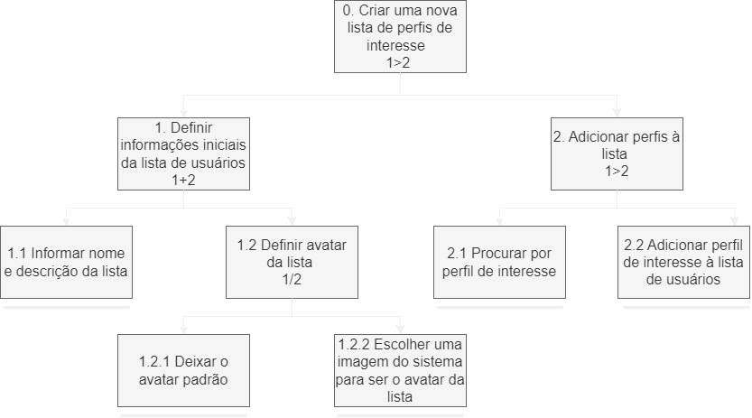
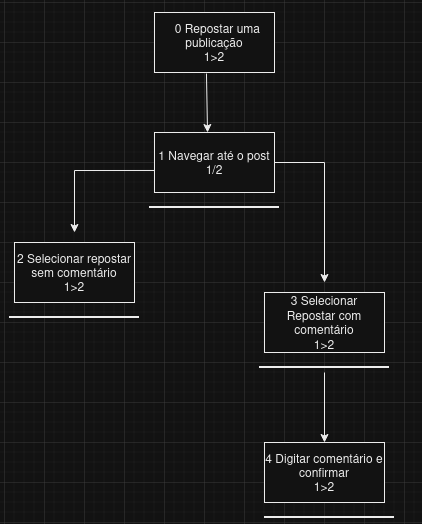
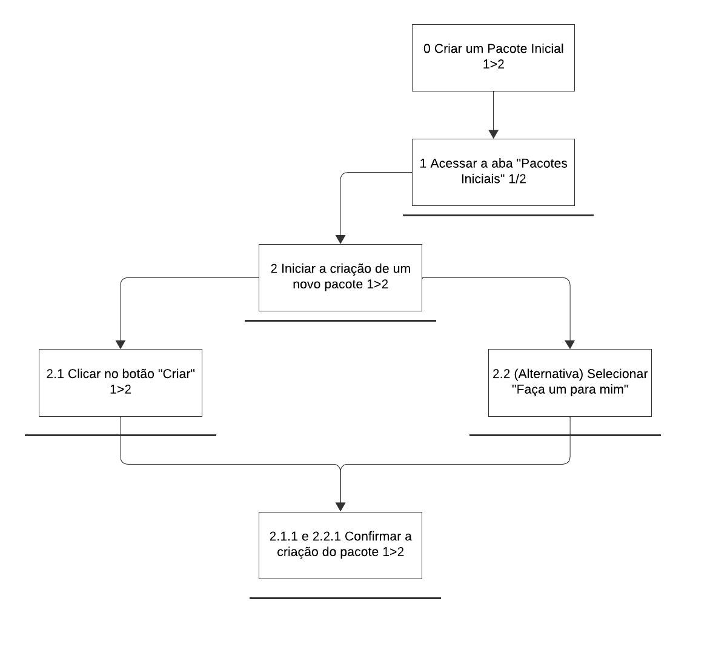

## Introdução

A Análise Hierárquica de Tarefas (HTA - Hierarchical Task Analysis) é uma técnica amplamente utilizada para decompor sistemas ou processos complexos em subtarefas menores e mais gerenciáveis. Esse método é crucial em diversos campos, como engenharia de fatores humanos, design de experiência do usuário (UX) e gerenciamento de processos, pois permite uma visão detalhada de como tarefas são realizadas por usuários, ajudando na otimização de sistemas e fluxos de trabalho. A HTA é frequentemente aplicada no desenvolvimento de interfaces de usuário, onde a complexidade das interações precisa ser organizada de forma hierárquica, visando melhorar a usabilidade e a experiência do usuário final.

Neste trabalho, será explorada a aplicação da HTA no contexto do site do BlueSky. O objetivo é identificar, analisar e estruturar as tarefas necessárias para a criação de um sistema de comunicação eficiente e intuitivo, focado nas necessidades do usuário e nos fluxos de interação que garantem uma experiência fluida e intuitiva.

## Metodologia

A metodologia adotada para a realização deste trabalho segue os princípios da Análise Hierárquica de Tarefas, que envolvem a decomposição de tarefas em níveis hierárquicos e sua análise detalhada. O processo será dividido nas seguintes etapas:

**Definição do Sistema e Objetivo**: Primeiramente, será definido o sistema a ser analisado, que no caso é o site do Bluesky. O objetivo principal será estabelecer como o sistema é estruturado, considerando as principais funções e fluxos de interação.

**Identificação das Tarefas e Subtarefas**: As principais tarefas envolvidas no requisito que está sendo analisado serão identificadas e listadas.

**Criação da Hierarquia de Tarefas**: Uma vez identificadas, as tarefas serão organizadas hierarquicamente, com as tarefas principais no topo e as subtarefas que detalham ações específicas em níveis inferiores. Cada tarefa será subdividida de acordo com sua complexidade e relação com outras ações.

**Determinação das Dependências**: As dependências entre as tarefas serão analisadas, identificando quais tarefas precisam ser realizadas antes das outras e quais podem ocorrer simultaneamente. Isso permitirá entender o fluxo de trabalho e otimizar o processo.

**Validação e Ajustes**: Após a construção da hierarquia, será realizada uma revisão do modelo para garantir que ele esteja alinhado com as expectativas do usuário e as necessidades do sistema. Feedback de stakeholders pode ser incorporado para ajustar e refinar a análise.

## Desenvolvimento

A análise hirárquica de tarefas será representada por meio de diagramas nos quais serão representadas as seguintes representações gŕaficas:

<figure markdown="span">
  { width="400" align="center" }
  <figcaption>Imagem 1: Legenda dos Diagramas de HTA. Autor: Carla A. C. Ribeiro.</figcaption>
</figure>

### 1. Envio de Mensagens Privadas

Com base na metodologia de Análise Hierárquica de Tarefas, foi realizada a análise do fluxo de envio de uma mensagem privada entre os usuários do site BlueSky. O diagrama desenvolvido pode ser visto abaixo: 

<figure markdown="span">
  { width="400" align="center" }
  <figcaption>Imagem 2: Diagrama HTA - Envio de mensagens privadas. Autor: Carla A. C. Ribeiro.</figcaption>
</figure>

<table>
<thead>
    <tr>
      <th>Objetivos / Operações</th>
      <th>Problemas e Recomendações</th>
    </tr>
  </thead>
  <tbody>
    <tr>
      <td>0. Enviar mensagem privada</td>
      <td><strong>Plano:</strong> Enviar mensagem privada para outro usuário da plataforma.  
          <strong>Feedback:</strong> Garantir que os usuários consigam trocar mensagens.</td>
    </tr>
    <tr>
      <td>1. Acessar aba de chat</td>
      <td><strong>Plano:</strong> Acessar a página de chat. 
          <strong>Feedback:</strong> Lista de conversas e a possibilidade da criação de novos chats.</td>
    </tr>
    <tr>
      <td>2. Selecionar conversa</td>
      <td><strong>Input:</strong> Selecionar conversa. 
          <strong>Feedback:</strong> Visualizar mensagens trocadas entre os usuários. 
          <strong>Recomendação:</strong> Melhorar o feedback para o usuário dos filtros selecionados.</td>
    </tr>
    <tr>
      <td>3. Criar novo chat</td>
      <td><strong>Input:</strong> Selecionar botão de criação de chat.</td>
    </tr>
    <tr>
      <td>3.2 Buscar usuário</td>
      <td><strong>Input:</strong> Selecionar usuário para a criação da conversa.</td>
    </tr>
    <tr>
      <td>2.1 e 3.1.1 Enviar mensagem</td>
      <td><strong>Input:</strong> Utilizar o input para enviar mensagens.</td>
    </tr>
  </tbody>
</table>

Tabela 1: Análise da HTA - Envio de mensagens privadas. Autor: Carla A. C. Ribeiro.

### 2. Criação de lista de usuário

A seguir, figura e tabela resultados da análise hierárquica da tarefa de criação de listas de usuário.

<figure markdown="span" align="center">
  { width="600" align="center" }
  <figcaption>Imagem 3: Diagrama HTA - Criação de Listas de Usuário.   Autor: João Ribeiro.</figcaption>
</figure>

| **Objetivos / operações**                                       | **problemas e recomendações**                                                                                                                                                                                                                        |
| --------------------------------------------------------------- | ---------------------------------------------------------------------------------------------------------------------------------------------------------------------------------------------------------------------------------------------------- |
| 0. Criar uma nova lista de perfis de interesse 1>2              | **plano:** definir informações iniciais da lista de usuários e após Adicionar perfis à lista **input:** nome, descrição e avatar da lista e perfis de interesse **feedback:** a nova lista criada é apresentada na página de listas de usuário |
| 1. Definir informações iniciais da lista de usuários  1+2       | **plano:** informar nome e descrição da lista e após definir avatar da lista                                                                                                                                                                         |
| 1.1 Informar nome e descrição da lista                          | **input:** nome e descrição da lista                                                                                                                                                                                                                 |
| 1.2 Definir avatar da lista 1/2                                 |                                                                                                                                                                                                                                                      |
| 1.2.1 Deixar o avatar padrão                                    |                                                                                                                                                                                                                                                      |
| 1.2.2 Escolher uma imagem do sistema para ser o avatar da lista | **input:** arquivo da imagem                                                                                                                                                                                                                         |
| 2. Adicionar perfis à lista 1 > 2                               | **plano:** procurar por perfil de interesse e depois adiciona-lo à lista                                                                                                                                                                             |
| 2.1 Procurar por perfil de interesse                            | **input:** nome ou parte do nome do perfil                                                                                                                                                                                                           |
| 2.2 Adicionar perfil de interesse à lista de usuários           | **recomendação:** diferenciar os botões 'adicionar' e 'remover' por cores                                                                                                                                                                            |

Tabela 2: Análise da HTA - Criação de Listas de Usuário. Autor: João Ribeiro.

## 3. Criação de uma repostagem

<figure markdown="span" align="center">
  { width="600" align="center" }
  <figcaption>Imagem 3: Diagrama HTA - Realizando repostagem.   Autor: Davi Nobre.</figcaption>
</figure>

<table>
<thead>
    <tr>
      <th>Objetivos / operações</th>
      <th>Problemas e recomendações</th>
    </tr>
  </thead>
  <tbody>
    <tr>
      <td><strong>0. Repostar uma publicação 1 > 2</strong></td>
      <td><strong>Plano:</strong> Identificar a publicação e decidir o tipo de repost. 
          <strong>Input:</strong> Escolha entre repostar com ou sem comentário. 
          <strong>Feedback:</strong> A publicação aparece na timeline do usuário como repostada.</td>
    </tr>
    <tr>
      <td><strong>1. Navegar até o post 1 / 2</strong></td>
      <td><strong>Plano:</strong> Localizar o post desejado navegando pela timeline ou usando a busca.</td>
    </tr>
    <tr>
      <td><strong>2. Selecionar repostar sem comentário</strong></td>
      <td><strong>Plano:</strong> Escolher a opção de repostar diretamente. 
          <strong>Feedback:</strong> O post é repostado instantaneamente na timeline do usuário.</td>
    </tr>
    <tr>
      <td><strong>3. Selecionar repostar com comentário</strong></td>
      <td><strong>Plano:</strong> Optar por adicionar um comentário ao repost.</td>
    </tr>
    <tr>
      <td><strong>4. Digitar comentário e confirmar 1 > 2</strong></td>
      <td><strong>Input:</strong> Inserir o comentário no campo designado. 
          <strong>Feedback:</strong> O post é repostado junto com o comentário do usuário na timeline.</td>
    </tr>
  </tbody>
</table>

Tabela 3: Análise da HTA - Realizando Repostagem. Autor: Davi Nobre.

## 4. Criação de um Pacote
A seguir, figura e tabela resultados da análise hierárquica da tarefa de criação de um pacote.
<figure markdown="span" align="center">
  { width="600" align="center" }
  <figcaption>Imagem 4: Diagrama HTA - Criando Pacotes.   Autor: Eduarda Tavares.</figcaption>
</figure>

<table>
  <thead>
    <tr>
      <th>Objetivos / Operações</th>
      <th>Problemas e Recomendações</th>
    </tr>
  </thead>
  <tbody>
    <tr>
      <td><strong>0. Criar um Pacote Inicial 1 > 2</strong></td>
      <td><strong>Plano:</strong> Iniciar o processo para criar um pacote inicial. 
          <strong>Input:</strong> Escolher entre criar manualmente ou usar a sugestão automática. 
          <strong>Feedback:</strong> O pacote inicial aparece na aba "Pacotes Iniciais".</td>
    </tr>
    <tr>
      <td><strong>1. Acessar a aba "Pacotes Iniciais" 1 / 2</strong></td>
      <td><strong>Plano:</strong> Localizar e acessar a aba "Pacotes Iniciais" no menu do perfil. 
          <strong>Problema:</strong> A aba pode não estar claramente visível para novos usuários. 
          <strong>Recomendação:</strong> Adicionar um ícone ou destaque visual para facilitar a identificação.</td>
    </tr>
    <tr>
      <td><strong>2. Iniciar a criação de um novo pacote 1 > 2</strong></td>
      <td><strong>Plano:</strong> Escolher a opção "Criar" ou "Faça um para mim". 
          <strong>Problema:</strong> A explicação das opções pode ser insuficiente para novos usuários. 
          <strong>Recomendação:</strong> Adicionar uma breve descrição das diferenças entre as opções antes da seleção.</td>
    </tr>
    <tr>
      <td><strong>2.1 Clicar no botão "Criar" 1 > 2</strong></td>
      <td><strong>Plano:</strong> Iniciar a criação manual do pacote. 
          <strong>Feedback:</strong> O sistema exibe uma interface para personalização.</td>
    </tr>
    <tr>
      <td><strong>2.2 (Alternativa) Selecionar "Faça um para mim"</strong></td>
      <td><strong>Plano:</strong> Utilizar a sugestão automática do sistema. 
          <strong>Feedback:</strong> O pacote é criado automaticamente com base nos dados do usuário.</td>
    </tr>
    <tr>
      <td><strong>2.1.1 e 2.2.1 Confirmar a criação do pacote 1 > 2</strong></td>
      <td><strong>Plano:</strong> Finalizar a criação do pacote manual ou automático. 
          <strong>Input:</strong> Clicar no botão "Salvar" ou "Finalizar". 
          <strong>Feedback:</strong> O sistema exibe uma mensagem de sucesso e adiciona o pacote à aba "Pacotes Iniciais".</td>
    </tr>
  </tbody>
</table>

Tabela 4: Análise da HTA - Criando Pacote. Autor: Eduarda Tavares.

## Bibliografia
> 1. Barbosa, S. D. J.; Silva, B. S. da; Silveira, M. S.; Gasparini, I.; Darin, T.; Barbosa, G. D. J. (2021) Interação Humano-Computador e Experiência do usuário.
Autopublicação. ISBN: 978-65-00-19677-1.

## Histórico de Versão 

    <table>
        <tr>
            <th>Data</th>
            <th>Versão</th>
            <th>Descrição</th>
            <th>Autor</th>
            <th>Data da Revisão</th>
            <th>Revisor</th>
        </tr>
        <tr>
            <td>01/12</td>
            <td>1.0</td>
            <td>Criação do documento e 1ª HTA.</td>
            <td><a href="https://github.com/ccarlaa">Carla Clementino</a></td>
            <td>02/12</td>
            <td><a href="https://github.com/Jagaima">Davi Nobre</a></td>
        </tr>
        <tr>
            <td>02/12</td>
            <td>1.1</td>
            <td>Adicionando criação de lista de usuários</td>
            <td><a href="https://github.com/JoaoV">João Vitor</a></td>
            <td>02/12</td>
            <td><a href="https://github.com/Jagaima">Davi Nobre </a></td>
        </tr>
        <tr>
            <td>02/12</td>
            <td>1.2</td>
            <td>Adicionando criação da tarefa repostagem</td>
            <td><a href="https://github.com/Jagaima">Davi Nobre</a></td>
            <td>02/12</td>
            <td><a</a></td>
        </tr>      
    </table>

