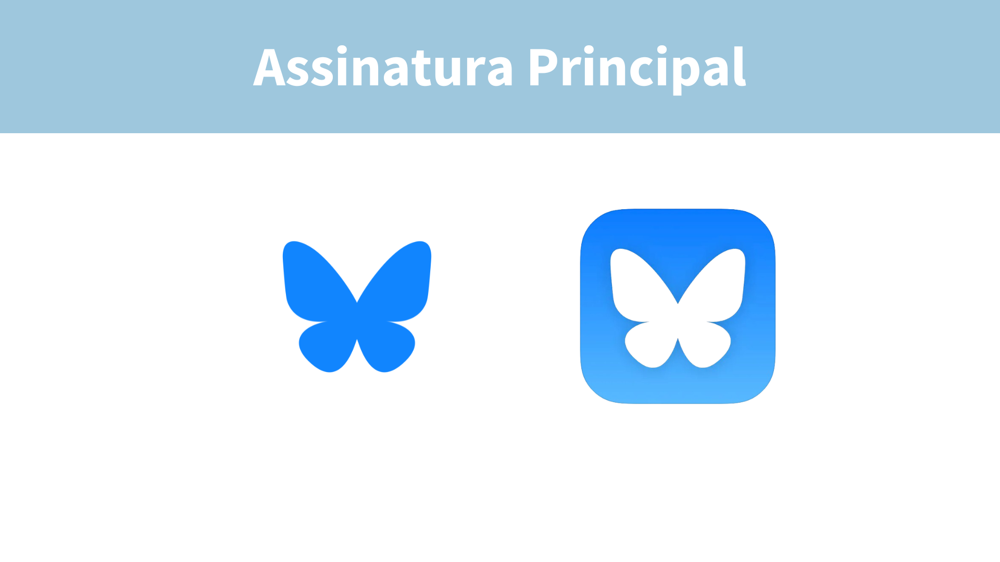
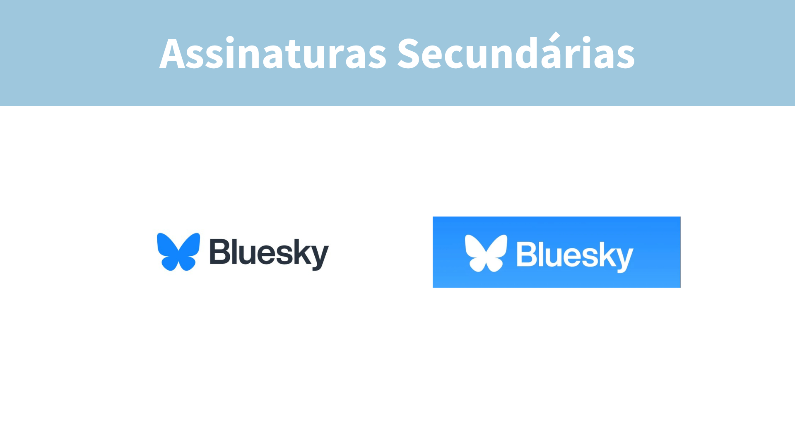
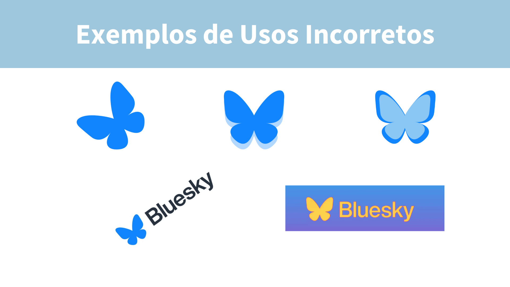
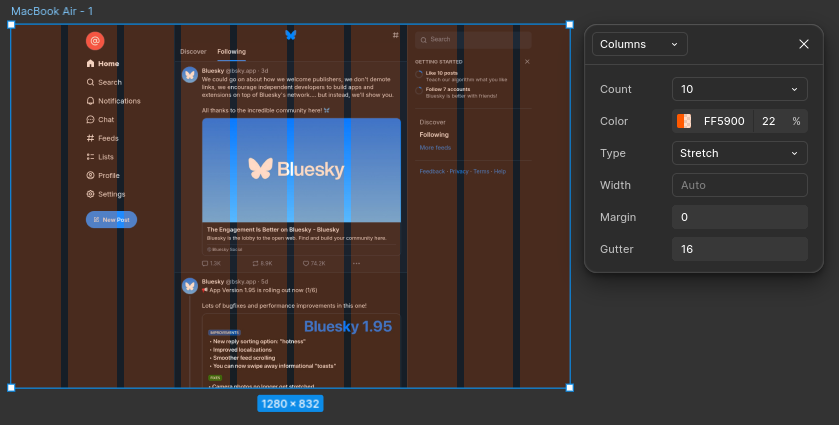

# Guia de Estilo

## Introdução

O guia de estilos é um conjunto planejado de elementos gráficos que comunicam, de maneira organizada e consistente, a essência de um projeto, produto ou serviço. Esses elementos incluem o logotipo, as cores, as tipografias e outros recursos visuais, todos cuidadosamente desenvolvidos para expressar os valores, a visão e a missão do Bluesky. Ela atua como a "assinatura visual" da marca, diferenciando-a e fortalecendo sua presença diante do público.

A consistência na aplicação da identidade visual é fundamental para construir reconhecimento e confiança, promovendo uma conexão sólida com os usuários. Pensando nisso, este manual foi elaborado para assegurar a integridade e padronização da identidade do Bluesky, fornecendo diretrizes claras sobre como aplicar corretamente os elementos visuais em diferentes contextos e materiais.

## Objetivo

O objetivo deste guia é estabelecer um padrão visual consistente para todos os produtos e serviços do Bluesky, garantindo que a identidade visual seja uniforme e eficaz em todas as comunicações.

## Desenvolvimento

### **Logotipo**

A escolha da borboleta como logo do Bluesky tem algumas explicações simbólicas e conceituais que se alinham à filosofia do projeto:

- **Simbologia de Transformação**: A borboleta é um símbolo universal de transformação, crescimento e liberdade. Isso reflete a visão do Bluesky de reimaginar as redes sociais, criando algo novo e descentralizado, em contraste com os sistemas tradicionais.
- **Leveza e Liberdade**: Assim como as borboletas voam livremente, a logo representa a ideia de uma rede social mais aberta e livre, permitindo que os usuários escolham como interagem e compartilham informações.
- **Estética Minimalista e Positiva**: O design da borboleta é simples, amigável e otimista, características que refletem a filosofia do projeto de criar uma rede social mais clara e positiva.

<figure markdown="span">
  { width="500" align="center" }
  <figcaption>Imagem 1: Assinatura principal. Autor: Carla Clementino.</figcaption>
</figure>

<figure markdown="span">
  { width="500" align="center" }
  <figcaption>Imagem 2: Assinatura secundária. Autor: Carla Clementino.</figcaption>
</figure>

### **Formas erradas de usar a logo**

Para garantir a integridade e a coesão da identidade visual, é essencial seguir rigorosamente as diretrizes estabelecidas neste manual. Qualquer aplicação inadequada pode comprometer a essência, o significado e o reconhecimento da marca, além de afetar a sua percepção pelo público.
As formas não recomendadas de uso incluem:

- **Alteração da tipografia institucional**: Substituir as fontes definidas compromete a harmonia e a legibilidade da identidade visual.
- **Distorção horizontal ou vertical**: Ajustar a proporção do símbolo ou do logotipo resulta em uma aparência desequilibrada e não profissional.
- **Deslocamento do símbolo ou descritor**: Alterar a posição relativa entre o símbolo e o texto desconfigura a composição original da marca.
- **Aplicação de efeitos 3D**: Adicionar profundidade ou elementos tridimensionais descaracteriza a simplicidade e clareza do design.
- **Girar o símbolo**: Modificar a orientação do símbolo compromete a coerência visual.
- **Aplicação de contornos**: Inserir bordas ou traços ao redor do símbolo ou do logotipo altera sua aparência original.
- **Adicionar sombras**: Efeitos de sombra comprometem a leveza e a clareza visual.
- **Aplicação de gradientes**: O uso de gradientes modifica as cores estabelecidas, prejudicando a consistência cromática.
  
Manter a aplicação correta da identidade visual é indispensável para preservar a integridade e o impacto da marca.

<figure markdown="span">
  { width="500" align="center" }
  <figcaption>Imagem 3: Uso incorreto da logo. Autor: Carla Clementino.</figcaption>
</figure>

### **Tipografia**

A tipografia desempenha um papel essencial na construção da identidade visual, garantindo a coesão e consistência da marca em todos os materiais. Ela não apenas diferencia o projeto, como também contribui para reforçar sua unidade visual, transmitindo profissionalismo e clareza.

A família de fontes Inter é amplamente utilizada no design de interfaces digitais devido à sua legibilidade, clareza e flexibilidade em diferentes tamanhos de tela. No contexto do Bluesky, Inter reflete os valores de simplicidade e acessibilidade da plataforma, contribuindo para uma experiência de usuário moderna e intuitiva.

<iframe style="border: 1px solid #2094F3; box-shadow: 0px 8px 16px rgba(0, 0, 0, 0.2); border-radius: 20px; padding: 20px 10px; transition: background-color 0.3s; cursor: pointer;" onmouseover="this.style.backgroundColor='#EDF7FF';" onmouseout="this.style.backgroundColor='';" markdown="span" width="100%" height="450" src="https://embed.figma.com/design/5NZOipwgYq6CZJYOtzfe6w/IHC---Bluesky?node-id=350-6942&embed-host=share" allowfullscreen></iframe>

Imagem 4: Tipografia. Autor: Carla Clementino.
 

### **Cores**

As cores principais da identidade visual do Bluesky são compostas por uma variação de tons de azul e tons de cinza. As cores podem ser descritas da seguinte maneira:

Tons de Azul:

- *#B9C9F7*: Um azul suave, que transmite calma e clareza.
- *#7D8FF7*: Um tom de azul médio, equilibrado, sugerindo estabilidade e confiança.
- *#1C74F6*: Um azul mais intenso, que transmite energia e inovação.
- *#0A4D87*: Um azul profundo, que adiciona um toque de profissionalismo e solidez.

Tons de Cinza:

- *#808E97*: Cinza claro, criando um fundo neutro para destacar outros elementos.
- *#4A526C*: Cinza médio, que mantém um equilíbrio visual e ajuda na legibilidade.
- *#1C1D1F*: Cinza escuro, quase preto, utilizado para dar contraste e reforçar a formalidade e a seriedade da marca.

<iframe style="border: 1px solid #2094F3; box-shadow: 0px 8px 16px rgba(0, 0, 0, 0.2); border-radius: 20px; padding: 20px 10px; transition: background-color 0.3s; cursor: pointer;" onmouseover="this.style.backgroundColor='#EDF7FF';" onmouseout="this.style.backgroundColor='';" markdown="span" width="100%" height="450" src="https://embed.figma.com/design/5NZOipwgYq6CZJYOtzfe6w/IHC---Bluesky?node-id=350-7401&embed-host=share" allowfullscreen></iframe>

Imagem 5: Cores. Autor: Carla Clementino.
 

### **Grid**

O grid é uma ferramenta fundamental no design, sendo amplamente utilizado para estruturar e organizar elementos visuais de forma equilibrada e harmoniosa. Em projetos de identidade visual, como o do Bluesky, o grid desempenha um papel crucial na criação de layouts consistentes e esteticamente agradáveis. Ele fornece uma base sólida para o alinhamento de elementos gráficos, tipografia e imagens, garantindo que todos os componentes se conectem visualmente de maneira coesa.

<figure markdown="span">
  { width="700" align="center" }
  <figcaption>Imagem 6: Grid. Autor: Carla Clementino.</figcaption>
</figure>

### **Iconografia**

Os ícones são elementos visuais poderosos que desempenham um papel essencial na comunicação gráfica de uma marca. No caso do Bluesky, os ícones servem como representações simples e diretas de conceitos complexos, contribuindo para a acessibilidade e a universalidade da identidade visual. Eles não apenas embelezam os designs, mas também orientam os usuários e reforçam a personalidade da marca.

<iframe style="border: 1px solid #2094F3; box-shadow: 0px 8px 16px rgba(0, 0, 0, 0.2); border-radius: 20px; padding: 20px 10px; transition: background-color 0.3s; cursor: pointer;" onmouseover="this.style.backgroundColor='#EDF7FF';" onmouseout="this.style.backgroundColor='';" markdown="span" width="100%" height="450" src="https://embed.figma.com/design/5NZOipwgYq6CZJYOtzfe6w/IHC---Bluesky?node-id=337-5536&embed-host=share" allowfullscreen></iframe>

Imagem 7: Iconografia. Autor: Carla Clementino.
 

## Documento Completo

<figure style="border: 1px solid #2094F3; box-shadow: 0px 8px 16px rgba(0, 0, 0, 0.2); border-radius: 20px; padding: 20px 10px; transition: background-color 0.3s; cursor: pointer;" onmouseover="this.style.backgroundColor='#EDF7FF';" onmouseout="this.style.backgroundColor='';" markdown="span">
{ width="500" align="center" }
  <figcaption>Documento 1: Guia de Estilo. Autor: Carla Clementino.</figcaption>
</figure>

## Bibliografia
> 1. Barbosa, S. D. J.; Silva, B. S. da; Silveira, M. S.; Gasparini, I.; Darin, T.; Barbosa, G. D. J. (2021) Interação Humano-Computador e Experiência do usuário.
Autopublicação. ISBN: 978-65-00-19677-1.s

## :round_pushpin: Histórico de Versão 

    <table>
        <tr>
            <th>Data</th>
            <th>Versão</th>
            <th>Descrição</th>
            <th>Autor</th>
            <th>Data da Revisão</th>
            <th>Revisor</th>
        </tr>
        <tr>
            <td>03/12</td>
            <td>1.0</td>
            <td>Criação do documento</td>
            <td><a href="https://github.com/ccarlaa">Carla Clementino</a></td>
            <td>03/12</td>
            <td><a href="https://github.com/erteduarda">Eduarda Tavares</a></td>
        </tr>
    </table>

