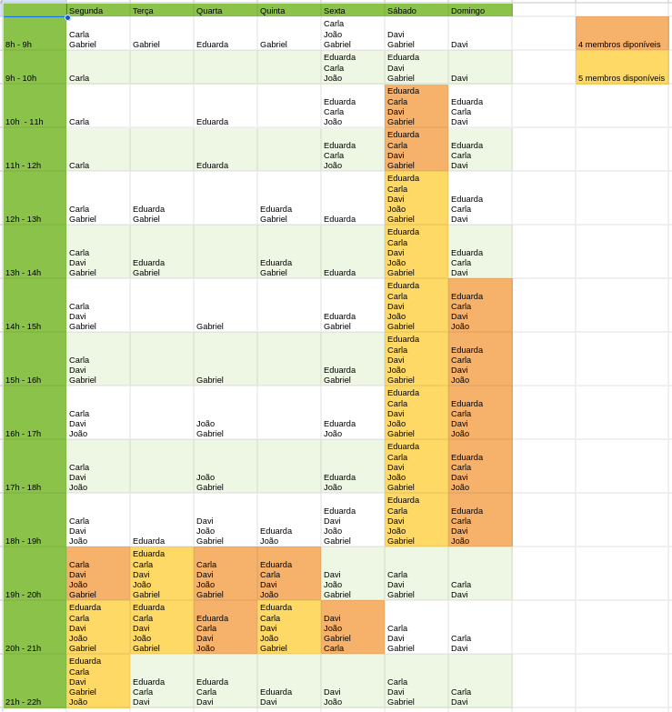

## Introdução
Este documento apresenta o mapeamento de disponibilidade dos membros do grupo para reuniões futuras, realizado como parte do planejamento inicial para o desenvolvimento de um aplicativo. Com o objetivo de garantir a coordenação e o alinhamento contínuo entre todos os participantes, foi aplicado um formulário Google Forms para registrar e organizar as preferências de horário e os dias mais adequados para encontros. Esse levantamento visa facilitar a comunicação e otimizar a colaboração, de modo a assegurar que todos possam contribuir ativamente ao longo do projeto. A partir dos dados coletados, será possível definir uma agenda de reuniões que melhor se ajuste aos horários dos integrantes, promovendo um ambiente de trabalho produtivo e eficiente.

## Objetivo
O objetivo do mapeamento de disponibilidade é facilitar a organização das reuniões de forma a maximizar a participação e o engajamento de todos os membros do grupo. Ao compreender os dias e horários mais convenientes para cada integrante, torna-se possível planejar encontros que respeitem as limitações e preferências individuais, promovendo uma colaboração mais eficiente e alinhada. Esse planejamento visa garantir que todos possam contribuir ativamente ao longo do desenvolvimento do aplicativo, fortalecendo a comunicação e a coesão do grupo.

## Metodologia
A metodologia para o mapeamento de disponibilidade dos membros foi estruturada em duas etapas principais: coleta de dados e consolidação das informações. Primeiramente, elaborou-se um formulário utilizando o Google Forms, o qual foi distribuído entre todos os integrantes do grupo. Este formulário continha campos para o preenchimento do nome do participante e para a indicação de disponibilidade de segunda a domingo, de forma a permitir que cada membro registrasse, de forma individual, seus horários preferenciais para as reuniões.

Após a coleta, os dados foram organizados em uma planilha compartilhada, permitindo uma visão integrada das preferências de cada membro. Nesta planilha, as disponibilidades foram agrupadas e categorizadas por dia da semana, facilitando a visualização de dias e horários com maior compatibilidade entre os integrantes.

## Resultados

Tabela 1: Disponibilidade dos integrantes do Grupo 1 (Fonte: autores, 2024)

## Conclusão

Após a análise dos resultados coletados, foi decidido que as reuniões ocorrerão às segundas-feiras, às 21h, e aos sábados, às 14h. Esses horários foram escolhidos com base nas disponibilidades mais frequentes dos membros, garantindo a presença do maior número de participantes. A combinação desses dois dias também permite uma distribuição equilibrada das reuniões ao longo da semana, favorecendo o acompanhamento contínuo das atividades e decisões do grupo.

## :round_pushpin: Histórico de Versão 

    <table>
        <tr>
            <th>Data</th>
            <th>Versão</th>
            <th>Descrição</th>
            <th>Autor</th>
            <th>Data da Revisão</th>
            <th>Revisor</th>
        </tr>
        <tr>
            <td>11/11</td>
            <td>1.0</td>
            <td>Criação do documento</td>
            <td><a href="https://github.com/ccarlaa">Carla Clementino</a></td>
            <td>03/11</td>
            <td><a href="https://github.com/Jagaima"> Davi Nobre</a></td>
        </tr>
    </table>

