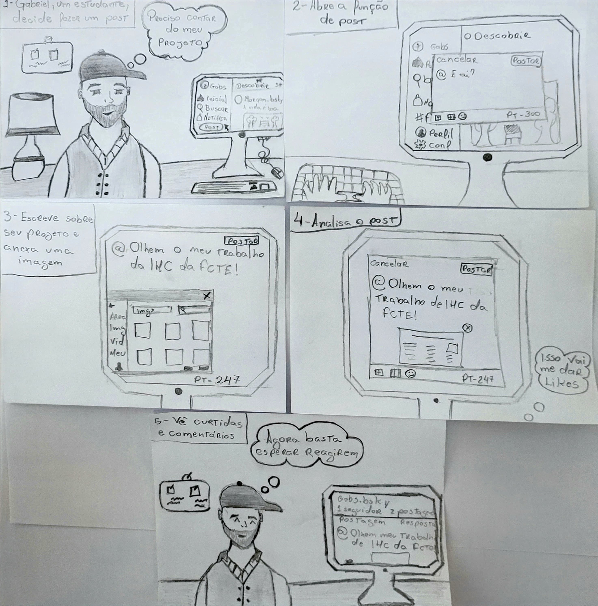
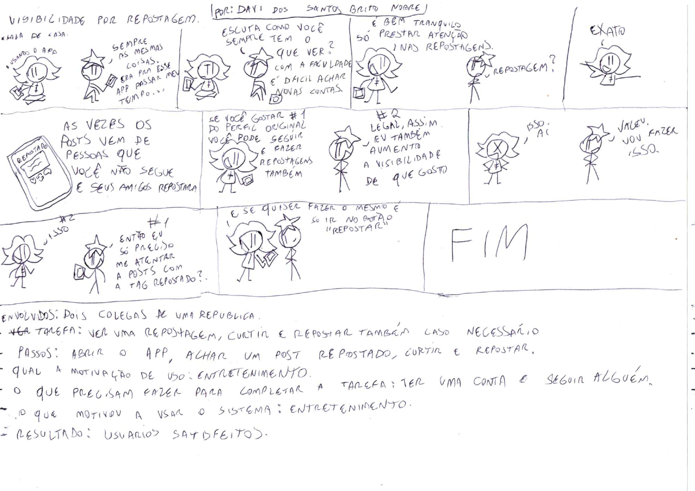
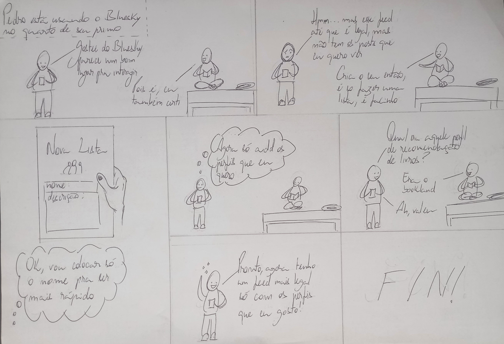

# Storyboards

## Introdução

O storyboard é uma ferramenta valiosa no design de interação, funcionando como um protótipo visual de baixa fidelidade. Essa técnica permite representar graficamente como os usuários interagem com um sistema, ilustrando o fluxo de tarefas de forma sequencial e narrativa. Essencialmente, um storyboard consiste em uma série de desenhos ou cenas que mostram, passo a passo, como um usuário realiza uma tarefa específica com o produto em desenvolvimento. 
No contexto de um projeto de design de interação, os storyboards são frequentemente criados após a análise de tarefas, como HTA (Hierarchical Task Analysis) e GOMS (Goals, Operators, Methods, and Selection rules). Eles traduzem os insights obtidos nessas análises em cenários visuais concretos, permitindo uma compreensão mais intuitiva e acessível do uso do sistema.
Em suma, o storyboard serve como uma ponte entre a análise abstrata de tarefas e o design concreto da interface, proporcionando uma visão holística da jornada do usuário e facilitando a identificação de oportunidades de melhoria no design da interação.

### Storyboard 1 - Publicação de Post no BlueSky:

O Storyboard a seguir ilustra a jornada de Gabriel, um estudante da FCTE, que deseja compartilhar seu projeto acadêmico na plataforma BlueSky. Gabriel, motivado a interagir com sua comunidade online, decide utilizar o site para publicar informações sobre o seu trabalho. Gabriel começa sua tarefa acessando o BlueSky através de seu navegador em casa, em um ambiente tranquilo. Ele busca a área de criação de post e, ao encontrá-la, clica para iniciar a publicação. Na tela de criação, Gabriel escreve um comentário sobre seu projeto e anexa uma imagem. Após revisar o conteúdo para garantir que tudo está correto, ele clica no botão de publicar. Com a publicação finalizada, Gabriel se sente realizado ao ver seu post disponível para seus seguidores, o qual rapidamente recebe interações e comentários, o que o encoraja a compartilhar mais conteúdos no futuro.

<figure markdown="span">
  { width="900" align="center" }
</figure>

<em>Figura 2 - Storyboard - Storyboard: Publicação de Post no BlueSky. Autor: Gabriel S. Monteiro</em>

  Autor: <a href="https://github.com/GabrielSMonteiro" target="_blank" rel="noopener noreferrer">Gabriel Monteiro</a>

### Storyboard 2 - Envio de Mensagem Privada:

O Storyboard a seguir ilustra a jornada de Maria, uma usuária da plataforma BlueSky, que deseja enviar uma mensagem privada para seu amigo João. Motivada a se conectar e conversar com seus contatos, Maria acessa o site do BlueSky através de seu navegador, em um momento tranquilo em casa. Ao navegar pela interface, ela busca o perfil de João em sua lista de contatos e clica para iniciar uma conversa privada. Na tela de chat, Maria escreve uma mensagem amigável, expressando seu interesse em saber como João está. Após revisar o texto, ela clica no botão de envio para garantir que a mensagem seja entregue. Com a confirmação de envio na tela, Maria sente-se satisfeita em ter iniciado uma conversa, aguardando que João visualize a mensagem e responda.

<figure markdown="span">
  { width="900" align="center" }
</figure>

<em>Figura 2 - Storyboard - Envio de Mensagem Privada. Autor: Carla A. C. Ribeiro</em>

#### Descrição do Storyboard:

Quadro 1: Abrindo o site do Bluesky

Descrição: Maria acessa o site do Bluesky pelo navegador.

Quadro 2: Entrando na aba de mensagem privada

Descrição: Maria clica no ícone de mensagens e busca o perfil de João.

Quadro 3: Enviando mensagem privada

Descrição: Maria envia uma mensagem privada para João.

Quadro 4: Recebendo mensagem privada

Descrição: Maria recebe uma mensagem privada de João.

### Storyboard 3 - Função de repostagem:

O storyboard a seguir representa a coversa entre dois colegas sobre o funcionamento da função de repostagem e suas facilidades no dia a dia para com o uso da plataforma. O storyboard a seguir representa a interação entre como identificar uma repostagem, qual sua utilidade prática e como o usuário comum da rede pode ele mesmo excecutar uma respostagem em sua página na plataforma Bluesky.

<figure markdown="span">
  { width="900" align="center" }
</figure>

<em>Figura 3 - Storyboard - Função de Repostagem. Autor: Davi Nobre</em>

### Storyboard 4 - Criação de lista de usuários:

O seguinte storyboard ilustra a jornada de Pedro que deseja encontrar posts de seu interesse com mais facilidade no Bluesky, sistema que se interessou para interagir digitalmente com outras pessoas. Seu primo, o qual já utilizou da rede social, o torna ciente da possibilidade de criar um feed personalizado a partir de uma lista de usuários e, assim, ele começa a criação de sua lista. Ele escolhe o nome dela, adiciona os perfis escolhidos e, por fim, consegue acessar um feed com posts de usuários de seu interesse.

<figure markdown="span">
  { width="900" align="center" }
</figure>

<em>Figura 4 - Storyboard - Criação de lista de usuários. Autor: João Ribeiro</em>

## Referência Bibliografia

> 1. BARBOSA, S. D. J.; SILVA, B. S. Interação Humano-Computador. Elsevier, 2011.
> 2. ROGERS, Yvonne; SHARP, Helen; PREECE, Jenny. Design de Interação: Além da Interação Humano-Computador. Tradução de Isabela Gasparini. 3. ed. Porto Alegre: Bookman, 2013.

## :round_pushpin: Histórico de Versão 

    <table>
        <tr>
            <th>Data</th>
            <th>Versão</th>
            <th>Descrição</th>
            <th>Autor</th>
            <th>Data da Revisão</th>
            <th>Revisor</th>
        </tr>
        <tr>
            <td>12/12</td>
            <td>1.0</td>
            <td>Criação do documento</td>
            <td><a href="https://github.com/GabrielSMonteiro">Gabriel Monteiro</a></td>
            <td>10/12</td>
            <td><a href="https://github.com/Jagaima">Davi Nobre</a></td>
        </tr>
        <tr>
            <td>16/12</td>
            <td>1.1</td>
            <td>Adicão 1° storyboard</td>
            <td><a href="https://github.com/GabrielSMonteiro">Gabriel Monteiro</a></td>
            <td>16/12</td>
            <td><a href="https://github.com/erteduarda">Eduarda Tavares</a></td>
        </tr>
        <tr>
            <td>04/01</td>
            <td>1.2</td>
            <td>Adicão 2° storyboard</td>
            <td><a href="https://github.com/ccarlaa">Carla Clementino</a></td>
            <td>05/01</td>
            <td><a href="https://github.com/erteduarda">Eduarda Tavares</a></td>
        </tr>
        <tr>
            <td>04/01</td>
            <td>1.3</td>
            <td>Adicão 3° storyboard</td>
            <td><a href="https://github.com/Jagaima">Davi Nobre</a></td>
            <td>05/01</td>
            <td><a href="https://github.com/erteduarda">Eduarda Tavares</a></td>
        </tr>
        <tr>
            <td>05/01</td>
            <td>1.4</td>
            <td>Atualização 1° storyboard</td>
            <td><a href="https://github.com/GabrielSMonteiro">Gabriel Monteiro</a></td>
            <td>05/01</td>
            <td><a href="https://github.com/erteduarda">Eduarda Tavares</a></td>
        </tr>
        <tr>
            <td>12/01</td>
            <td>1.5</td>
            <td>Adicão 4° storyboard</td>
            <td><a href="https://github.com/Joa0V">João Ribeiro</a></td>
            <td>13/01</td>
            <td><a href="https://github.com/erteduarda">Eduarda Tavares</a></td>
        </tr>
    </table>

