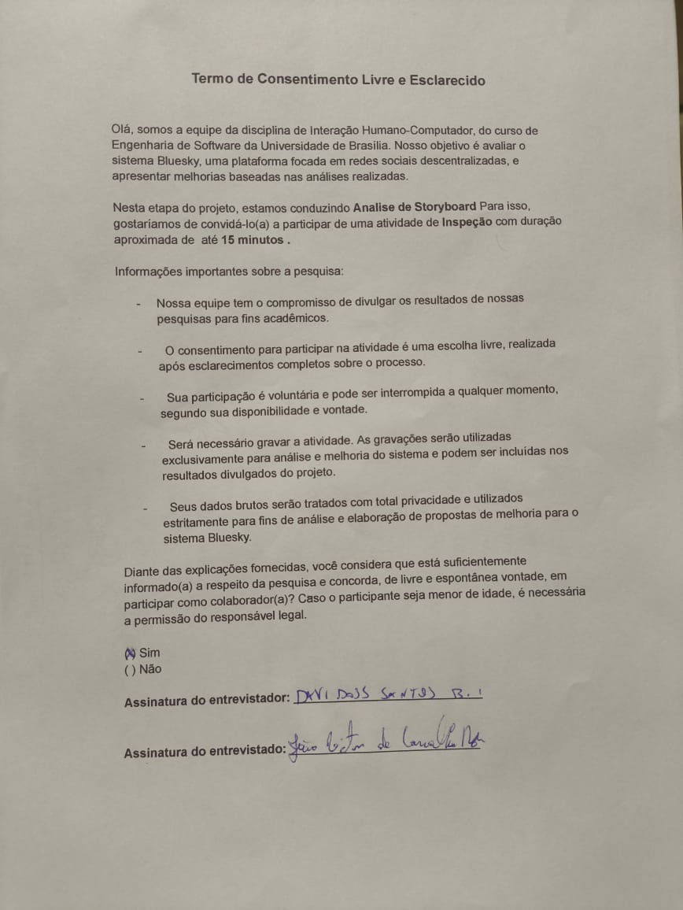

## Introdução 

Um storyboard é uma pequena historia em quadros feita com o intuito de exemplificar parte do funcionamento de um produto. O planejamento desta avaliação de Storyboard envolverá definir critérios chave avaliativos. 
 
 Baseado nisso criamos um planejamento de avaliação dos Storyboards, o que nos deu a seguinte documentação.

## Objetivo e escopo da avaliação:

O objetivo dessa avaliação é validar uma versão utilizável para nossos storyboards para que sejam o mais coesos, entendíveis e condizentes possíveis. Assim podemos identificar problemas em nas interações do usuário com o sistema para uso futuro.

## Método de avaliação

O método adotado será a observação combinada com entrevistas aos usuários. A seguir, tabela com o cronograma executado:

Tabela 1: Cronograma Executado

| Entrevistador(es) | Entrevistado(s) | Horário de Início | Horário de Fim |    Data    | Local                      |
| ----------------- | --------------- | :---------------: | :------------: | :--------: | -------------------------- |
| Davi              | João Victor     |       19:10       |     19:16      | 05/01/2025 | Residência do entrevistado |
| João Ribeiro      | Sebastian       |       11:45       |     11:52      | 08/01/2025 | FCTE - S6                  |

Autor: [João Ribeiro](https://github.com/Joa0V).

## Execução do roteiro

Baseando-se no roteiro construido no nosso planejamento, passamos pela primeira etapa realizada no dia 19/12/2024, onde o grupo 1 executou seu teste piloto e validou as perguntas desenvolvidas para serem passadas pelo usuário. Segue abaixo a gravação do teste piloto: 

**Vídeo 1**  - Perguntas para o usuário: Teste Piloto

<iframe width="1280" height="720" src="https://www.youtube.com/embed/YW9tz6dI0ck" title="teste piloto" frameborder="0" allow="accelerometer; autoplay; clipboard-write; encrypted-media; gyroscope; picture-in-picture; web-share" referrerpolicy="strict-origin-when-cross-origin" allowfullscreen></iframe>

<b>Autor:</b> <a href="https://github.com/Jagaima">Davi, Gabriel, Eduarda, João e Carla</a>
 

## Seleção dos Participantes

Para conseguir respostas concisas com nosso público alvo fomos um pouco além da idade e conseguimos na faculdade dois usuários de redes sociais de microblogs, sendo um deles usuário ativo da plataforma. Aqui estão os resultados de nossa avaliação com as gravações e os termos de conscentimento dos usuários. 

## Feedback dos Usuários

Abaixo seguem as tabelas contendo as respostas obtidas dos usuários pra os Storyboards desenvolvidos pelo grupo. 

**Tabela 2**  - Perguntas para o usuário: Storyboard 1. (Desenvolvido por Gabriel)

| Pergunta                                                                                       | Resposta       |
| ---------------------------------------------------------------------------------------------- | -------------- |
| 1. O objetivo do storyboard está claramente definido?                                          | (X) SIM () NÃO |
| 2. Você se identifica como o público-alvo?                                                     | () SIM (X) NÃO |
| 3. Há uma linha do tempo lógica entre os quadros?                                              | (X) SIM () NÃO |
| 4. Os atores do storyboard são condizentes com a realidade?                                    | (X) SIM () NÃO |
| 5. As transições entre os quadros são suaves e compreensíveis?                                 | (X) SIM () NÃO |
| 6. As tarefas realizadas pelos atores condizem com o que se espera do produto?                 | (X) SIM () NÃO |
| 7. Os quadros são visualmente poluídos, dificultando a concentração no seu objetivo principal? | (X) SIM () NÃO |

<b>Autor:</b> <a href="https://github.com/Jagaima">Davi</a>
 

**Tabela 3**  - Perguntas para o usuário: Storyboard 2. (Desenvolvido por Carla)

| Pergunta                                                                                       | Resposta       |
| ---------------------------------------------------------------------------------------------- | -------------- |
| 1. O objetivo do storyboard está claramente definido?                                          | (X) SIM () NÃO |
| 2. Você se identifica como o público-alvo?                                                     | () SIM (X) NÃO |
| 3. Há uma linha do tempo lógica entre os quadros?                                              | (X) SIM () NÃO |
| 4. Os atores do storyboard são condizentes com a realidade?                                    | (X) SIM () NÃO |
| 5. As transições entre os quadros são suaves e compreensíveis?                                 | (X) SIM () NÃO |
| 6. As tarefas realizadas pelos atores condizem com o que se espera do produto?                 | (X) SIM () NÃO |
| 7. Os quadros são visualmente poluídos, dificultando a concentração no seu objetivo principal? | (X) SIM () NÃO |

<b>Autor:</b> <a href="https://github.com/Jagaima">Davi</a>
 

**Tabela 4**  - Perguntas para o usuário: Storyboard 3. (Desenvolvido por Davi)

| Pergunta                                                                                       | Resposta       |
| ---------------------------------------------------------------------------------------------- | -------------- |
| 1. O objetivo do storyboard está claramente definido?                                          | (X) SIM () NÃO |
| 2. Você se identifica como o público-alvo?                                                     | (X) SIM () NÃO |
| 3. Há uma linha do tempo lógica entre os quadros?                                              | (X) SIM () NÃO |
| 4. Os atores do storyboard são condizentes com a realidade?                                    | (X) SIM () NÃO |
| 5. As transições entre os quadros são suaves e compreensíveis?                                 | (X) SIM () NÃO |
| 6. As tarefas realizadas pelos atores condizem com o que se espera do produto?                 | (X) SIM () NÃO |
| 7. Os quadros são visualmente poluídos, dificultando a concentração no seu objetivo principal? | (X) SIM () NÃO |

<b>Autor:</b> <a href="https://github.com/Jagaima">Davi</a>
 

**Tabela 5**  - Perguntas para o usuário: Storyboard 4. (Desenvolvido por João)

| Pergunta                                                                                       | Resposta       |
| ---------------------------------------------------------------------------------------------- | -------------- |
| 1. O objetivo do storyboard está claramente definido?                                          | (X) SIM () NÃO |
| 2. Você se identifica como o público-alvo?                                                     | (X) SIM () NÃO |
| 3. Há uma linha do tempo lógica entre os quadros?                                              | (X) SIM () NÃO |
| 4. Os atores do storyboard são condizentes com a realidade?                                    | () SIM (X) NÃO |
| 5. As transições entre os quadros são suaves e compreensíveis?                                 | (X) SIM () NÃO |
| 6. As tarefas realizadas pelos atores condizem com o que se espera do produto?                 | (X) SIM () NÃO |
| 7. Os quadros são visualmente poluídos, dificultando a concentração no seu objetivo principal? | () SIM (X) NÃO |

<b>Autor:</b> <a href="https://github.com/Joa0V">João Ribeiro</a>
 

### Sugestões de melhorias

O Usuário participante da segunda avaliação comentou sobre a forma de interação apresentada no storyboard 4. Segundo ele, usualmentet não fala com outra pessoa para aprender sore uma plataforma de rede social, seria mais comum pesquisar na internet ou até mesmo no próprio sistema.

## Gravações das entrevistas

O vídeo a seguir contem a gravação da entrevista com o Usuário João Victor de Carvalho. Estudante da UNB e que usa ativamente o bluesky para postar suas artes e trabalhos comissionados. 

**Vídeo 2**  - Perguntas para o usuário: Entrevista com usuário João Victor

<iframe width="1280" height="720" src="https://www.youtube.com/embed/t4Emueenigc" title="Entrevista com o usuário - Storyboard" frameborder="0" allow="accelerometer; autoplay; clipboard-write; encrypted-media; gyroscope; picture-in-picture; web-share" referrerpolicy="strict-origin-when-cross-origin" allowfullscreen></iframe>

<b>Autor:</b> <a href="https://github.com/Jagaima">Davi</a>
 

O vídeo a seguir contem a gravação da entrevista com o Usuário Sebastian. Estudante da UnB e que usa regularmente redes sociais, em especial as de microblogs, como o Twitter.

**Vídeo 3**  - Perguntas para o usuário: Entrevista com usuário Sebastian

<iframe width="1280" height="720" src="https://www.youtube.com/embed/FDXWVvARPpI" title="Entrevista com o usuário - Storyboard" frameborder="0" allow="accelerometer; autoplay; clipboard-write; encrypted-media; gyroscope; picture-in-picture; web-share" referrerpolicy="strict-origin-when-cross-origin" allowfullscreen></iframe>

<b>Autor:</b> <a href="https://github.com/Joa0V">João Ribeiro</a>
 

## Termo de Livre Conscentimento.

Respeitando a vontade do usuário, foi desenvolvido, informado e assinado todos os termos do documento ético desenvolvido pelo grupo em entregas passadas.

<figure markdown="span">
  { width="900" align="center" }
</figure>

<em>Figura 1 - Termo de livre Conscentimento João Victor. Autor: Davi Nobre</em>

## Problemas e dificuldades encontradas

Na segunda avaliação apresentada neste artefato, realizada nas depedências da FCTE, teve de haver a interrupção da avaliação devido a entrada de outros alunos na sala, os quais não mantiveram o silêncio durante o processo de avaliação. Isso, somado ao ruído externo dos automóveis, impactou a realização do processo por parte dos participantes.

## Conclusões.
O grupo não conseguiu um número maior de usuários para a avaliação do Storyboard e HTA, limitando usuários individuais a avaliações distintas dada a distância física de ambos os usuários escolhidos que decidiram aceitar a avaliação.

Baseando-se no fato de que um dos dois entrevistados ativamente usa a plataforma e este avaliou três dos storyboards totais e usamos somente funções que existem no sistema e são esperadas dele, notamos uma deficiência geral na avaliação do grupo, uma vez que tirando o terceiro Storyboard, todos os os outros abordados na primeira avaliação falharam em entender o que é mais importante para um dos tipos de público alvo. O Público alvo parece estar mais voltado ao lado artístico/conteúdo da plataforma, onde pode interagir com amigos e usuários aleatórios no que diz respeito a suas idéias e produções em mídia no geral. Infelizmente a falta de storyboards extra nos dá menos margem de validação desse fato, porém nosso perfil de usuário sustenta muito essa tese. O ideal é que o grupo passe a focar mais no lado das ideias e expressão do usuário do que em funções que ele pode fazer em outras plataformas dedicadas (ex.: função de chat). Ainda concluí-se que a solução de IHC deve permitir que o uso do sistema seja suficiente para o  aprendizado de como interagir com o ele, sem a necessidade do auxílio de um outro usuário mais experiente para isso.

# Bibliografia

> 1. Lichess. Análise Hierárquica de Tarefas. Repositório do Grupo Lichess da disciplina de Interação Humano Computador da Universidade de Brasília, 2022.2. Disponível em: <https://interacao-humano-computador.github.io/2022.2-Lichess/design_avaliacao_desenvolvimento/nivel_1/storyboard/planejamento_avaliacao/> Acesso em 26/12/2024 ás 21:00

> 2. BARBOSA, S. D. J.; SILVA, B. S. Interação Humano-Computador. Elsevier, 2011.

> 3. Bilheteria Digital. Análise Hierárquica de Tarefas. Repositório do Grupo Bilheteria Digital da disciplina de Interação Humano Computador da Universidade de Brasília, 2023.1. Disponível em: <https://interacao-humano-computador.github.io/2023.1-BilheteriaDigital/analise-de-requisitos/analise-de-tarefas/hta/.> Acesso em 26/12/2024 ás 21:01

## :round_pushpin: Histórico de Versão 

    <table>
        <tr>
            <th>Data</th>
            <th>Versão</th>
            <th>Descrição</th>
            <th>Autor</th>
            <th>Data da Revisão</th>
            <th>Revisor</th>
        </tr>
        <tr>
            <td>05/01</td>
            <td>1.0</td>
            <td>Criação do documento</td>
            <td><a href="https://github.com/Jagaima">Davi Nobre</a></td>
            <td>12/01</td>
            <td><a href="https://github.com/Joa0V">João Ribeiro</a></td>
        </tr>
        <tr>
            <td>12/01</td>
            <td>1.1</td>
            <td>Adição da avalição do storyboard</td>
            <td><a href="https://github.com/Joa0V">João Ribeiro</a></td>
            <td>14/12</td>
            <td><a href="https://github.com/erteduarda">Eduarda Tavares</a></td>
        </tr>
    </table>

